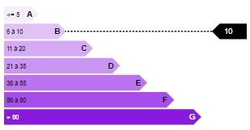
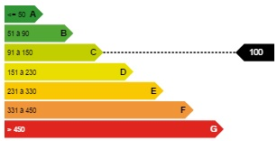

# vuejs-energy

Simple energy rating using vue.js component.




## Usage
### presets
```html
...
<script src="vuejs.energy.min.js"></script>
...
<energy v-model="energy" preset="dpe"></energy>
...
<script>
new Vue({
    el: '#app',
    data:{
        energy:10 //could be a Letter (from A to G) OR a positive number
    }
});
</script>
```

#### available presets
* `dep`
* `ges`

### custom settings
```html
...
<script src="vuejs.energy.min.js"></script>
...
<energy v-model="energy" :settings="settings"></energy>
...
<script>
new Vue({
    el: '#app',
    data:{
        settings:[
            {color:'#f6eefd', letter:'A', legend:'<= 5', isValid:(i) => i <= 5},
            {color:'#e0c2f8',letter:'B', legend:'6 to 10', isValid:(i) => i >= 6 && i <= 10},
            ....
        ],
        energy:10
    }
});
</script>
```
#### settings
an array of objects
```javascript
var settings = [
    {color:'#f6eefd', letter:'A', legend:'<= 5', isValid:(i) => i <= 5},
    {color:'#e0c2f8',letter:'B', legend:'6 to 10', isValid:(i) => i >= 6 && i <= 10},
    {color:'#d4aaf6', letter:'C', legend:'11 to 20', isValid:(i) => i >= 11 && i <= 20},
    {color:'#cb95f3',letter:'D', legend:'21 to 35', isValid:(i) => i >= 21 && i <= 35},
    {color:'#ba72ef',letter:'E', legend:'36 to 55', isValid:(i) => i >= 36 && i <= 55},
    {color:'#a74deb',letter:'F', legend:'56 to 80', isValid:(i) => i >= 56 && i <= 80},
    {color:'#8919df', text_color:'#fff', letter:'G', legend:'> 80', isValid:(i) => i > 80}
];
```
* `color` = row color
* `letter` = letter which is display at the end of the colored line
* `legend` = text which is display at the beginning of the colored line
* `isValid` = method called to check if the input value match the colored line (called when v-model is provided)
* `text_color` = (optional) the font color (default black)


## Demo
http://codepen.io/pdupavillon/pen/MpomQz
